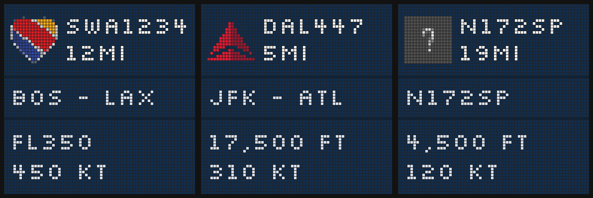

A real-time ADS-B dashboard for the [Divoom Pixoo64](https://www.divoom.com/products/pixoo-64) that tracks the nearest aircraft from a local [dump1090](https://github.com/flightaware/dump1090) receiver and displays live flight data on the 64×64 LED matrix. Route data is enriched automatically via free public APIs, with airline logos fetched and cached from FlightAware's CDN.



## Requirements

- Python 3.10+
- A dump1090 receiver on your local network
- A Divoom Pixoo64 on your local network

## Setup

```bash
git clone https://github.com/yourname/pixoo-adsb.git
cd pixoo-adsb
cp sample.config.json config.json
# edit config.json with your receiver and Pixoo64 IPs
bash setup.sh
source venv/bin/activate
python main.py
```

## Configuration

All settings live in `config.json`. See `sample.config.json` for a fully annotated reference.

| Section | Key | Description |
|---|---|---|
| `adsb` | `host` | IP of your dump1090 host |
| `adsb` | `receiver_lat` / `receiver_lon` | Your antenna location (required for distance) |
| `adsb` | `poll_interval` | Seconds between polls (default: 10) |
| `pixoo` | `host` | IP of your Pixoo64 |
| `pixoo` | `brightness` | 0–100 |
| `display` | `distance_unit` | `"km"` or `"mi"` |
| `display` | `fl_transition_ft` | Altitude above which FL notation is used (default: 18000) |
| `display` | `color_background` | Hex color for background (e.g. `"#000000"`) |
| `display` | `color_separator` | Hex color for the separator lines (default: `"#1e1e1e"`) |
| `display` | `color_flight` | Hex color for flight number and distance |
| `display` | `color_route` | Hex color for origin/destination |
| `display` | `color_data` | Hex color for altitude and speed |
| `flight_data` | `enabled` | Toggle route enrichment on/off |
| `flight_data` | `sources` | Ordered array of enrichment sources (see Route Enrichment) |
| `operating_hours` | `enabled` | Restrict operation to a time window (default: false) |
| `operating_hours` | `start` / `end` | 24-hour times e.g. `"07:00"` / `"23:00"`; overnight ranges supported |

## Display Layout

```
┌────────────────────────────┐
│ [logo] FLIGHT#             │
│        DISTANCE            │
├────────────────────────────┤
│ ORIGIN - DEST / TAIL       │
├────────────────────────────┤
│ FL350 / 17,500 FT          │
│ 450 KT                     │
└────────────────────────────┘
```

When no route is found, the aircraft tail number is shown in place of origin/destination. At or above `fl_transition_ft`, altitude is displayed as a flight level (e.g. FL350) rather than feet.

## Route Enrichment

Routes are looked up via an ordered list of sources defined in `flight_data.sources`. Each source is tried in turn; the first hit wins. Results are cached to disk for `flight_data.cache_ttl_seconds` seconds.

Sources are pluggable: built-in types are `aeroapi`, `aerodatabox`, `hexdb`, and `adsbdb`. Custom sources can be registered at startup via `enrichers.register("mytype", MySource)` and then referenced by name in config.

### Free sources (no key required)

**`hexdb`** and **`adsbdb`** use static callsign→route databases and work out of the box. They are reliable for common routes but can be stale or missing for newer/regional flights.

### Paid sources

Both paid sources are disabled by default. Set `"enabled": true` and supply an `api_key` to activate either one. Place whichever you subscribe to above the free sources in the array.

**`aeroapi`** — [FlightAware AeroAPI](https://www.flightaware.com/aeroapi/). Queries live flights by callsign ident. Auth header: `x-apikey`.

**`aerodatabox`** — [AeroDataBox via api.market](https://api.market/store/aedbx/aerodatabox). Queries live flights for today and yesterday. Auth header: `x-api-market-key`.

```json
"flight_data": {
  "sources": [
    { "type": "aeroapi",     "enabled": false, "api_key": "" },
    { "type": "aerodatabox", "enabled": false, "api_key": "" },
    { "type": "hexdb",       "enabled": true },
    { "type": "adsbdb",      "enabled": true }
  ]
}
```

______________________________________________________________________

## Release Notes

### v1.8.0

- **Silkscreen pixel font**: switched from JetBrains Mono to [Silkscreen](https://fonts.google.com/specimen/Silkscreen) by Jason Kottke, a bitmap-style font designed for small pixel displays. All text is now rendered at 8px uniformly.
- **True 1-bit text rendering**: text is composited via a 1-bit mask, bypassing FreeType antialiasing entirely. Every text pixel is fully on or fully off — no blending with the background.
- **Emulator pixel grid**: the local emulator now renders each logical pixel with a `#222222` border, simulating the diffuser panel on the real device. `make sample` applies the same effect to the preview image.

### v1.7.0

- **Logo background fix**: airline logos (transparent PNGs) are now composited against `display.color_background` instead of a hardcoded black. The cache key includes the background color, so changing the color automatically fetches fresh composited logos.

### v1.6.0

- **Null enrichment caching**: when all sources fail to find a route, the miss is now cached for the full `cache_ttl_seconds` duration. Subsequent polls for the same callsign return immediately without hitting any APIs.

### v1.5.0

- **Hex color values**: all color config fields now accept hex strings (e.g. `"#f7dd7d"`) in addition to RGB arrays. CSS named colors (e.g. `"white"`) are also supported via Pillow's `ImageColor`.
- **Configurable background color**: added `display.color_background` to control the frame background (default: `"#000000"`), applied to both the flight display and the ADSB OFFLINE message screen.
- **Configurable separator color**: added `display.color_separator` to control the horizontal divider lines between display sections (default: `"#1e1e1e"`).

### v1.4.0

- **FlightAware AeroAPI enrichment source**: new `aeroapi` source queries live flight data via the [FlightAware AeroAPI](https://www.flightaware.com/aeroapi/). Available free for personal use under FlightAware's personal-use tier (rate-limited; check their terms). Disabled by default; set `"enabled": true` and supply an `api_key` in the sources config to activate.

### v1.3.0

- **Pluggable enrichment sources**: enrichers are now modular: each source lives in its own file (`enrichers/aerodatabox.py`, `enrichers/hexdb.py`, `enrichers/adsbdb.py`) and implements a common `EnrichmentSource` interface. Custom sources can be registered at runtime via `enrichers.register()` and referenced by name in config.
- **Config-driven source ordering**: `flight_data.sources` is now an explicit ordered array; cascade priority, per-source options (e.g. `api_key`), and enable/disable are all controlled per-entry in config.

### v1.2.0

- **Operating hours**: optionally restrict the script to a configured time window (`operating_hours.start` / `operating_hours.end`). Overnight ranges supported (e.g. 22:00–06:00). Disabled by default; the script is idle outside the window and resumes automatically.

### v1.1.0

- **AeroDataBox enrichment**: optional live route lookups via [AeroDataBox on api.market](https://api.market/store/aedbx/aerodatabox). Queries today and yesterday, then falls back to the free static sources. Significantly improves accuracy for routes the static databases miss or have wrong.
- **Improved ICAO→IATA conversion**: full airport lookup table via the `airportsdata` package replaces heuristic prefix stripping; European and other non-US/CA airports now resolve correctly.
- **Local emulator**: `make emulate` opens a 4× upscaled pygame window running the full display pipeline locally, no Pixoo64 required.
- **Pixel-accurate rendering**: disabled text anti-aliasing (`fontmode="1"`) and switched all image scaling to nearest-neighbor for a crisp LED-matrix look.
- **Font resilience**: graceful fallback to the PIL built-in font if JetBrains Mono is missing or corrupt; `.gitattributes` prevents TTF corruption on clone.

### v1.0.0: Initial Release

First working release. Core features:

- Polls a local dump1090 receiver and selects the nearest aircraft by haversine distance
- Displays airline logo (fetched + cached from FlightAware CDN), flight number, tail number, distance, origin/destination route, altitude, and speed
- FL notation above configurable transition altitude
- Distance in km or miles
- Route enrichment via HexDB and AdsbDB (no API key required)
- All display colors configurable via `config.json`
- 60-second force-refresh keeps the Pixoo64 from reverting to its idle screen
- Graceful degradation: shows tail number when route is unknown, grey placeholder when no logo is available, ADSB OFFLINE message when the receiver is unreachable

______________________________________________________________________

## Fonts

Display text is rendered using [Silkscreen](https://fonts.google.com/specimen/Silkscreen) by Jason Kottke.
Licensed under the [SIL Open Font License 1.1](fonts/OFL.txt).

______________________________________________________________________

## A Note on Development

Portions of this project were written with the assistance of agentic LLM tooling (Claude Code). All generated code was reviewed, tested, and validated by a professional software engineer before being committed. The architecture, feature decisions, and final implementation are the author's own.

## License

Apache 2.0: see [LICENSE](LICENSE).
